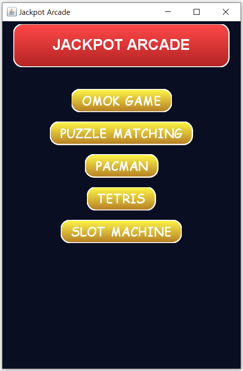
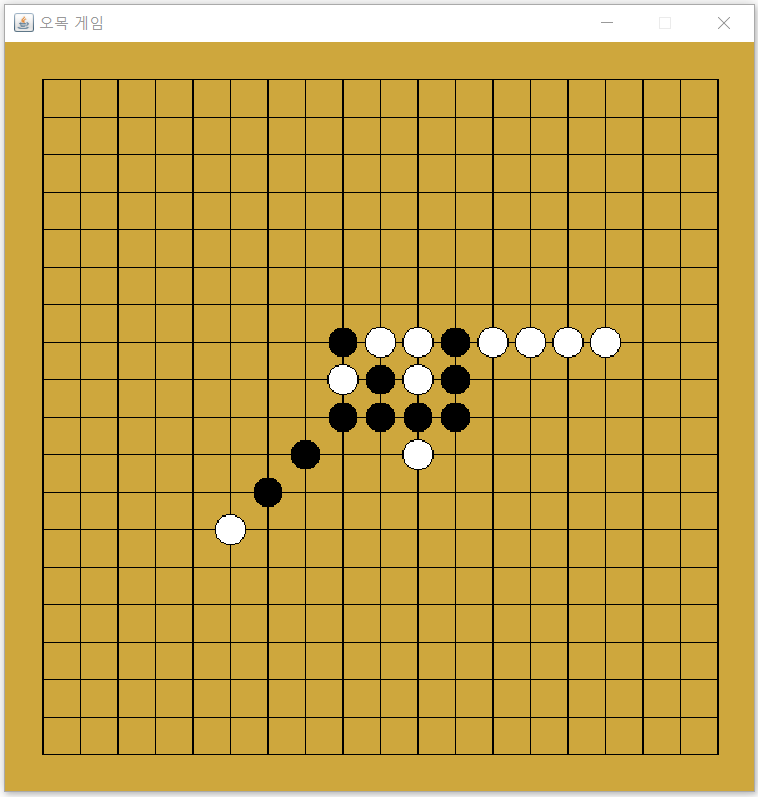
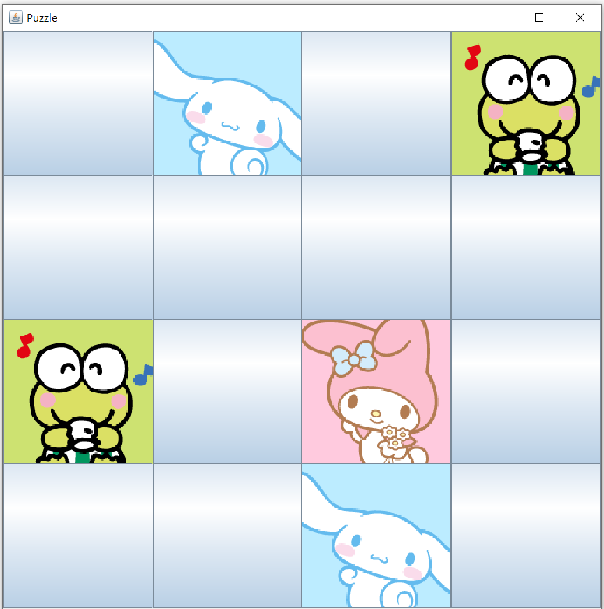
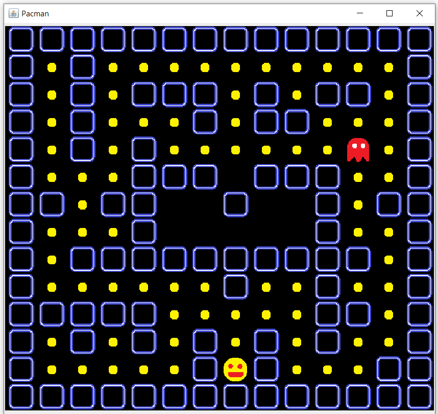
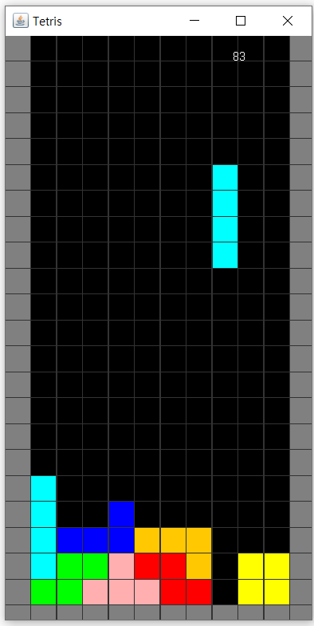
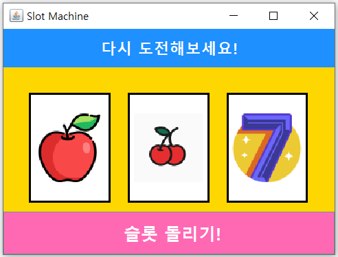
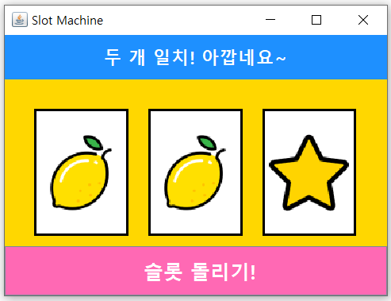
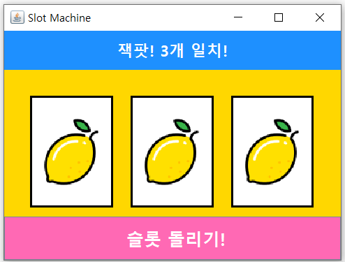

# 🎮 Jackpot Arcade

Java GUI 기반의 아케이드 게임 모음입니다.  
오목, 그림 맞추기, 팩맨, 테트리스, 슬롯머신 다섯 가지 게임을 하나의 플랫폼에서 실행할 수 있도록 구성했습니다.

---

## 📌 주요 기능

| 게임                          | 설명 |
|-----------------------------|------|
| 🎯 오목 (Omok)                | 마우스로 돌을 두며 5개를 먼저 연결하면 승리 |
| 🧩 그림 맞추기 (Puzzle matching) | 같은 그림 2개를 맞추는 퍼즐 게임 |
| 👻 팩맨 (Pacman)              | 방향키로 팩맨을 움직여 점수를 얻고 유령을 피함 |
| 🧱 테트리스 (Tetris)            | 떨어지는 블록을 조작해 줄을 만들고 제거 |
| 🎰 슬롯머신 (Slot machine)      | 버튼 클릭으로 슬롯을 돌리고 잭팟 여부 확인 |

---

## ▶ 실행 방법

1. `MainFrame.java` 파일을 실행합니다.
2. 메인 화면에 표시되는 5가지 게임 중 원하는 게임 버튼을 클릭하여 실행합니다.

---

## 🕹️ 조작 방법

- **오목**: 마우스 왼쪽 클릭(흑), 오른쪽 클릭(백)
- **그림 맞추기**: 마우스로 2개의 버튼 클릭
- **팩맨**: 방향키 ← ↑ ↓ → 조작
- **테트리스**:
    - ← →: 좌우 이동
    - ↑: 회전
    - ↓: 하강
    - Space: 빠르게 낙하
- **슬롯머신**: `슬롯 돌리기!` 버튼 클릭

---

## 🛠 개발 환경 및 기술 스택

- **언어**: Java 17
- **GUI**: Java Swing (javax.swing), AWT (java.awt)
- **개발 툴**: IntelliJ IDEA

### 📂 구조
```
MainFrame.java           - 게임 선택 메인화면
├── OmokGame.java        - 오목 게임
├── PuzzleGame.java      - 그림 맞추기
├── PacmanGame.java      - 팩맨
├── TetrisGame.java      - 테트리스
└── SlotMachineGame.java - 슬롯머신
```

## 🖼️ 스크린샷

## 🖼️ 게임 화면 스크린샷

### 🎮 메인 화면


---

### 🟤 오목 (Omok)
- 플레이 화면  
  


---

### 🧩 그림 맞추기 퍼즐 (Puzzle Matching)

- 퍼즐 두 개 성공 시  
  

---

### 👻 팩맨 (Pacman)
- 게임 실행 중  
  


---

### 🧱 테트리스 (Tetris)
- 블록 떨어지는 화면  
  

---

### 🎰 슬롯머신 (Slot Machine)

- 결과 1: 무작위 심볼  
  

- 결과 2: 두 개 일치  
  

- 결과 3: 잭팟!  
  

